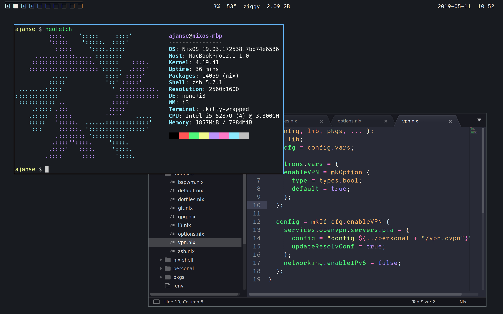
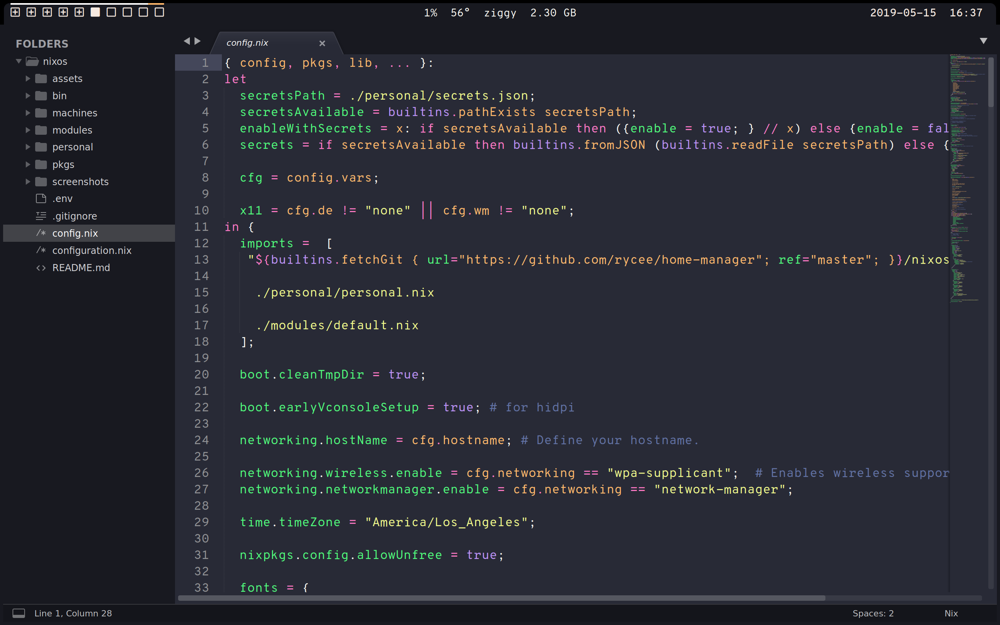
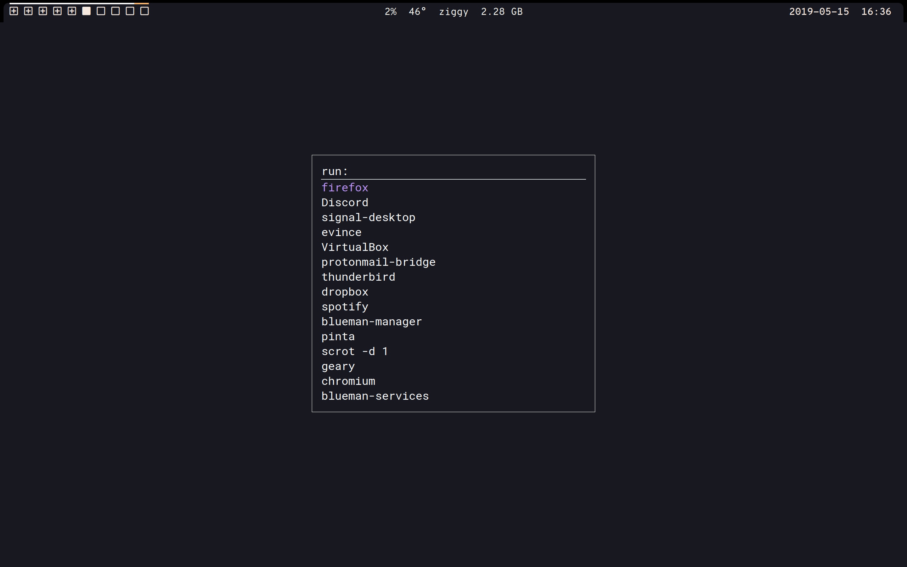
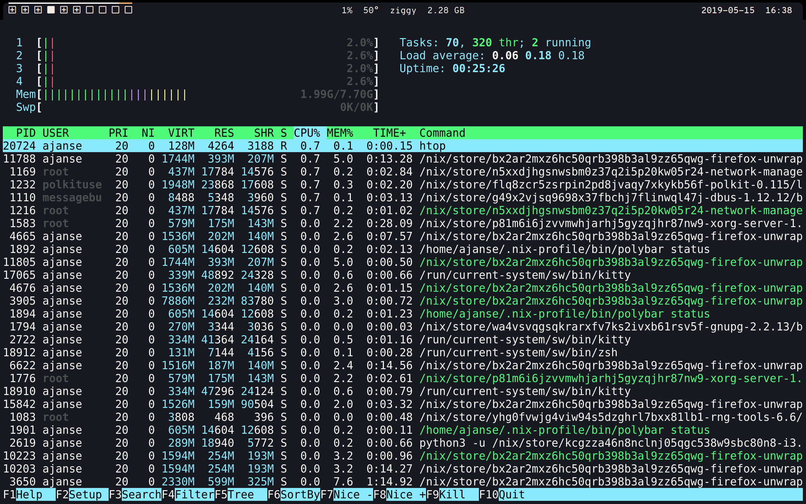

# NixOS Dotfiles

<p float="left">
  
   
</p>
<p float="left">
  
  
</p>

## Generating ISO

Install [nixos-generators](https://github.com/nix-community/nixos-generators)
```
nix-env -f https://github.com/nix-community/nixos-generators/archive/master.tar.gz -i
```

And generate:
```
nixos-generate -c ./machines/demo -f iso
```

Or:

```
nix-build '<nixpkgs/nixos>' -A config.system.build.isoImage -I configs/usb.nix
```

## Installation

Download [nixos minimal](https://nixos.org/nixos/download.html), put it on a thumb drive:

```bash
sudo dd if=nixos-minimal.iso of=/dev/sdx status=progress
```

Once booted onto the thumb drive, you'll want to figure out which disk you are formatting:

```bash
lsblk
```

Now, for full disk encryption:

```bash
cryptsetup luksFormat /dev/DISK
cryptsetup luksOpen /dev/DISK nixosroot
mkfs.ext4 /dev/mapper/nixosroot
```

Now we mount our partition:
```
mount /dev/mapper/nixosroot /mnt
mkdir /mnt/boot
mount /dev/BOOTDISK /mnt/boot
```

Generate NixOS config:

```bash
nixos-generate-config --root /mnt
```

Setup networking: https://nixos.org/nixos/manual/index.html#sec-installation-booting-networking

To install these dotfiles:

```bash
cd /mnt/etc/nixos

nix-env -iA nixos.git
git clone git@github.com:aaronduino/nixos
```

To finally install:

```bash
nixos-install
```
